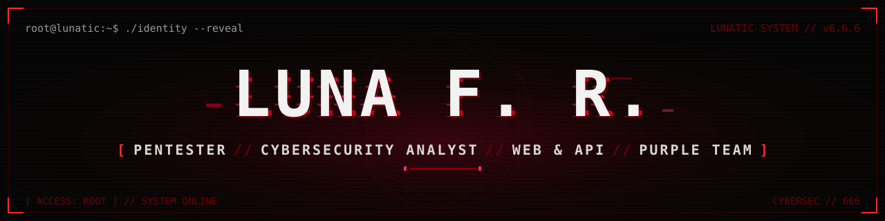
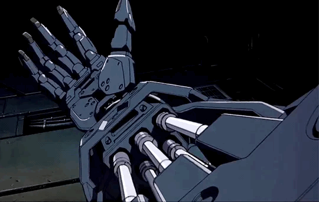
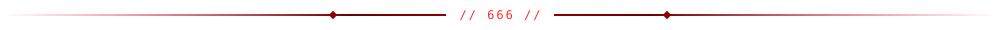
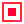

<!-- =========================================================================
     LUNA F. R. // GITHUB PROFILE README
     root@lunatic:~$ cat README.md
     -------------------------------------------------------------------------
     Required assets (all inside this repository's /assets folder):
       assets/banner.svg           hero banner
       assets/luna-cyberpunk.gif   hero GIF
       assets/divider.svg          section divider
       assets/marker.svg           section marker icon
       assets/btn-linkedin.svg     LinkedIn button
       assets/btn-portfolio.svg    portfolio button
     ========================================================================= -->

  

  

  
  
  
  
  
  

  

<h2 align="center">&nbsp;&nbsp;// WHOAMI</h2>

  <code>root@lunatic:~$ whoami</code>

  Offensive security on the clock — <strong>web &amp; API pentesting</strong>, reconnaissance,
  <strong>authentication &amp; authorization testing</strong> and vulnerability research.
  Authorized scope only, documented end to end, findings explained like a human wrote them. 
  The other half of the brain runs <strong>Purple Team</strong>: monitoring, detection and threat hunting —
  breaking things without reading the logs is just vandalism. 
  Linux is home. C, Golang and industrial-grade riffs are the house soundtrack.

<em>"If it's exposed, it's a finding. If it's authenticated, it's a challenge."</em>

  

<h2 align="center">&nbsp;&nbsp;SYSTEM // ARSENAL</h2>

<h3 align="center">LANGUAGES&nbsp;//&nbsp;05</h3>

  
  
  
  
  

<h3 align="center">ENVIRONMENT&nbsp;//&nbsp;SYSTEMS&nbsp;//&nbsp;04</h3>

  
  
  
  

<h3 align="center">OFFENSIVE SECURITY&nbsp;//&nbsp;16</h3>

  
  
  
  
  
  
  
  
   
  
  
  
  
  
  
  
  

<h3 align="center">MONITORING&nbsp;//&nbsp;PURPLE TEAM&nbsp;//&nbsp;02</h3>

  
  

  

<h2 align="center">&nbsp;&nbsp;// TELEMETRY</h2>

<!-- Optional block — remove it if you want a cleaner page. -->

  
  

  

<h2 align="center">&nbsp;&nbsp;// UPLINK</h2>

  
  &nbsp;
  

  

  

<code>root@luna:~$ exit</code>

<strong>[ SYSTEM STATUS: STILL ALIVE ]</strong>

// END OF TRANSMISSION — 666

